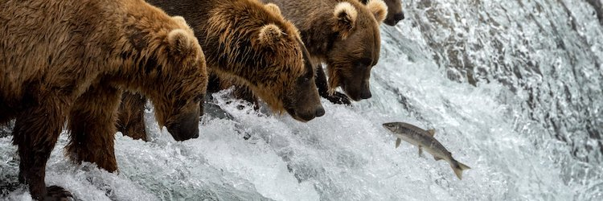

# Project 2

## National Parks Service API Vignette

My goal for this project was to write a vignette for contacting the National Parks Service API. I have created several functions to retrieve data on NPS parks and their activities, campgrounds and fees.

- My project repository can be found [here](https://github.com/sarahpagan/558-project2).

- My vignette is rendered on github-pages [here](https://sarahpagan.github.io/558-project2/).

A few new programming tasks I learned in the process of devolping the vignette were building API urls using functions, dividing a cell containing multiple observed values into individual rows using the `seperate_rows()` function, and making a heat map using `geom_tile()`. Furthermore, I attempted to produce some simple maps with help from the `sf` package. However, I still feel like I have a lot to learn about working with geospatial data in R!

While tackling the data analysis portion of the project, I did wish I had more numeric data to work with. When approcahing a similar project in the future, I would perform a better, preliminary investigation of the data to determine whether or not the data is suitable for the statistics I want to produce.

Overall, this project made me more comfortable working with APIs. Equally as aignificant, it taught me how easy it can be to integrate git with R projects.
