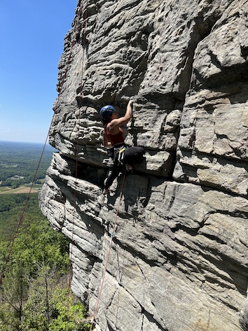
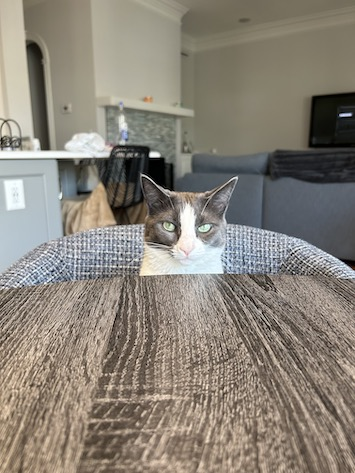

**Hi, my name is Sarah**.

I'm a Master of Statistics student at North Carolina State University and Adjunct Research Associate at the Institute for Defense Analysis (IDA) Science and Technology Policy Institute (STPI). Outside of work and school, I enjoy spending time hanging out with my cat and rock climbing in Western North Carolina.

This is my blog about **Data Science**.

 

